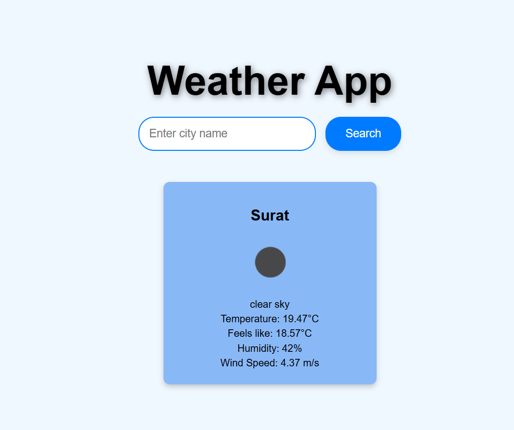

# Weather App

A simple weather application built with React that allows users to check the current weather in any city. The app fetches weather data from the OpenWeatherMap API and displays it in a sleek, modern interface with a beautiful background image from Unsplash.

### Prerequisites

Make sure you have the following installed:

- [Node.js](https://nodejs.org/)
- [npm](https://www.npmjs.com/)
- A code editor such as [VSCode](https://code.visualstudio.com/)

## Available Scripts

In the project directory, you can run:

## Technologies used

-React
-CSS
-Weather Open APi
### `npm start`

Runs the app in the development mode.\
Open [http://localhost:3000]to view it in your browser.

### ScreenShot 

-  .png>)
